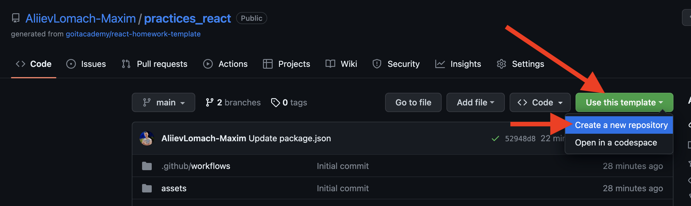
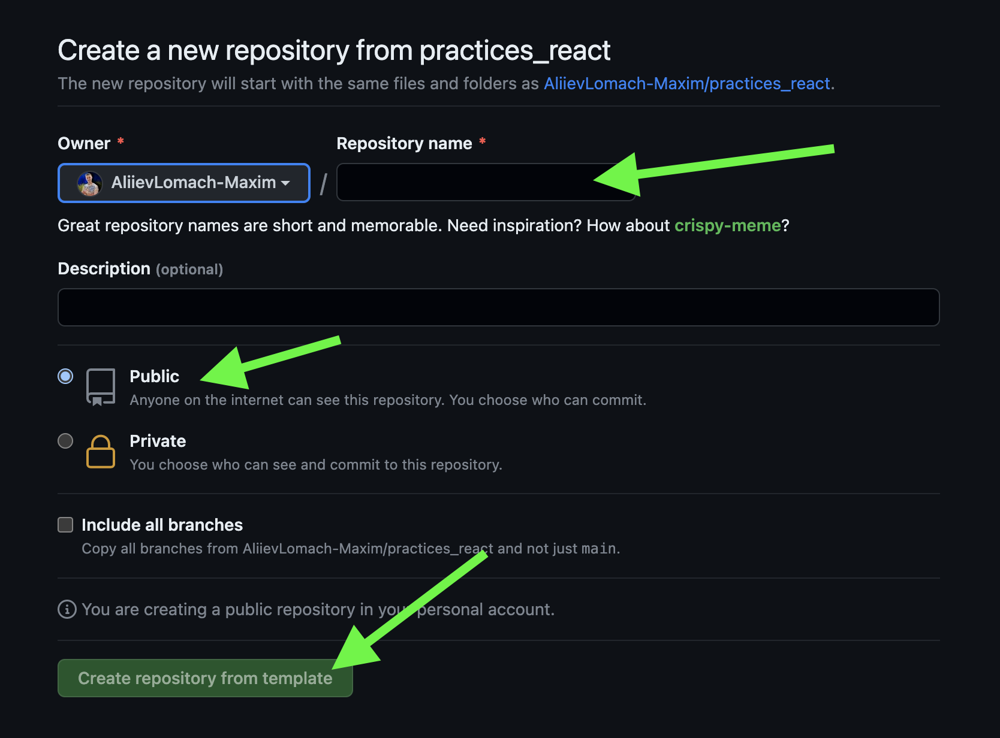

# React practices template

Цей проект було створено за допомогою
[Create React App](https://github.com/facebook/create-react-app). Для знайомства
та налаштування додаткових можливостей
[зверніться до документації](https://facebook.github.io/create-react-app/docs/getting-started).

> Цей проект є демонстраційним прикладом результату, який мають отримати
> студенти під час практики.

> Приклад коду для кожного зайняття лежить у гілці з відповідною назвою:

> Module-(номер модулю)/Less-(номер уроку)

<details>
  <summary>Створення репозиторію за шаблоном</summary>

## Створення репозиторію за шаблоном

Використовуйте цей репозиторій як шаблон для створення репозиторію свого
проекту. Для цього натисніть на кнопку `«Use this template»` та оберіть опцію
`«Create a new repository»`, як показано на зображенні.

 Далі, у
Вас відкриється сторінка створення нового репозиторію. Заповніть поле імені та
переконайтесь, що репозиторій публічний, після цього натисніть кнопку
`«Create repository from template»`.

 Після
того, як репозиторій буде створено, необхідно перейти до налаштувань цього
репозиторію, а саме: `Settings` > `Actions` > `General`, як показано на
зображенні.


Скролимо сторінку до самого низу. Далі, у секції `«Workflow permissions»`
потрібно обрати опцію `«Read and write permissions»` та поставити галочку на
чекбокс. Це необхідно для автоматизації процесу деплоя проекту.


Тепер, Ви маєте власний репозиторій проекту, з такою ж самою структурою файлів
та папок, як на шаблоні. Далі, працюйте з ним, як з будь-яким особистим
репозиторієм, клонуйте його мобі на компʼютер, пишіть код, робіть коміти та
відправляйте їх на GitHub.

</details>
<details>
  <summary>Модуль 1</summary>
  
###
<details>
  <summary>Заняття 1</summary>

### Заняття 1

-   [ ] Створити шаблон проекту з
        [шаблону для ДЗ](https://github.com/goitacademy/react-homework-template#readme)
-   [ ] Налаштувати проект згідно
        [Readme](https://github.com/goitacademy/react-homework-template#readme)
-   [ ] Перевірити деплой
-   [ ] Клонувати проект на ПК
-   [ ] Створити гілку `Module-01/Less-01` для практики

---

-   [ ] Розглянути структуру проекту
-   [ ] Розглянути детально файли `index.js`, `index.css`, `App.jsx`
-   [ ] Почистити файл `App.jsx` щоб він рендерив пустий фрагмент
-   [ ] Відправити файл `users.json` студентам, щоб вони додали його собі.
    > (файл містить масив юзерів, який потрібно зарендерити)
-   [ ] Розглянути файл `users.json`, як виглядає, що містить, що маємо
        зарендерити

---

-   [ ] У файлі `App.jsx`, зробити імпорт `users` з файлу `users.json`
-   [ ] Створити компонент `UsersList.jsx`
-   [ ] Зарендерити компонент `UsersList.jsx` в компоненті `App.jsx`
-   [ ] Передати через пропси `users` з компоненту `App.jsx` </br>в компонент
        `UsersList.jsx`. (далі `компонент 1`)
-   [ ] В `компоненті 1`, отримуємо users за допомогою деструктуризації пропсів
-   [ ] В рендері `компоненту 1`, створюємо `<ul></ul>`, де запускаємо
        </br>метод `map` по масиву `users`.
-   [ ] На кожній ітерації створюємо `<li></li>`, де як текст має бути імʼя
        юреза.
-   [ ] Дивимось результат в браузері. Вікриваємо консоль та обговорюємо
        помилку.
-   [ ] Фіксимо її. Додаємо пропс `key` зі значенням `id` юзера, елементу
        `<li></li>`.
-   [ ] Дивимось результат в браузері.
-   [ ] Створюємо всередені елементу `<li></li>` теги та наповнюємо </br>їх з
        даними юзера, згідно завдання.
-   [ ] Перевіряємо результат.

---

-   [ ] Створюємо новий компонент `User.jsx` (далі `компонент 2`)
-   [ ] Забираємо розмітку, яку повертає метод `map` в `компоненті 1` та
        </br>додаємо її в рендер `компоненту 2`.
-   [ ] Імпортуємо `компонент 2` в `компонент 1`.
-   [ ] Додаємо рендер `компоненту 2` як результат виконання методу `map`.
-   [ ] Передаємо через пропси `компоненту 2` параметр `user` </br>(елемент
        ітерації методу `map`)
-   [ ] Робимо деструктуризацію `user` з пропсів та глибоку деструктуризацію
        всіх необхідних ключів.
-   [ ] Дивимось результат в браузері. Вікриваємо консоль та обговорюємо
        помилку.
-   [ ] Фіксимо її. Додаємо пропс `key` зі значенням `id` юзера, `компоненту 2`.
-   [ ] Дивимось результат в браузері.
-   [ ] Інсталюємо пакет `'prop-types'`
-   [ ] Розписуємо обʼєкт `propTypes` для `компоненту 2`
-   [ ] Розписуємо обʼєкт `propTypes` для `компоненту 1`

---

-   [ ] Виконуємо коміт та пуш в гілку `Module-01/Less-01`
-   [ ] Створюємо `Pull request` на гілку `main`. Мержимо.

---

---

</details>

<details>
  <summary>Заняття 2</summary>
  
### Заняття 2

-   [ ] Створюємо нову гілку `Module-01/Less-02`

---

-   [ ] Створюємо пустий компонент `Section.jsx`
-   [ ] Огортаємо ним компонент `UsersList.jsx` (в рендері `App.jsx`)
-   [ ] Також огортаємо ним рендер компоненту `User.jsx` (тобто елемент
        `<li></li>`)
-   [ ] В компоненті `Section.jsx` додаємо в рендер парний тег
        `<section></section>`
-   [ ] Дивимось результат в браузері.
-   [ ] Оговорюємо зі студентами, яким чином зарендерити компоненти, </br>які ми
        огорнули в `<Section>`. (пропс children)
-   [ ] Додаємо {children} в рендер між тегами `<section>`

```javascript
<section>{children}</section>
```

---

-   [ ] Переходимо в `App.jsx` та передаємо компоненту `Section` пропс
        title='Users List'
-   [ ] В компоненті `Section.jsx` додаємо в деструктуризацію пропс `title`.
-   [ ] Додаємо тег `<h2>` з текстом `title` в середину тегу
        `<section></section>`
-   [ ] Аналізуємо зі студентами ситуцію, що пропс `title` приходить не завжди.
-   [ ] Додаємо рендер за умовою, за допомогою `&&`.

---

> module.css

-   [ ] Створюємо файл `Section.module.css`
-   [ ] В цьому файлі пишемо селектор з невеликою стилізацією (на свій смак) для
        класу `.baseSection`
-   [ ] В компоненті `Section` імпортуємо стилі з `Section.module.css`
-   [ ] Додаємо клас `.baseSection` тегу `<section>`
-   [ ] Дивимось результат в браузері.
-   [ ] У файлі `Section.module.css` створюємо ще один селектор для класу
        `.superSection`
-   [ ] В цьому селекторі необхідно повторити всі стилі з попереднього
        селектору</br> та додати свої, оговорюємо це зі студентами. (`composes`)
-   [ ] Використовуємо `composes` для повторення стилів та дописуємо додатково
        якісь (на власний смак)
-   [ ] В компоненті `Section` обговорюємо зі студентами як зробити
        додавання</br> класу за умою, в залежності від пропсу `title`.

---

> styled-components

-   [ ] Інсталюємо бібліотеку `styled-components@5.3.10`
-   [ ] Створюємо файл `User.styled.js`
-   [ ] Імпортуємо в нього `styled` з бібліотеки `styled-components`
-   [ ] Інсталюємо розширення `vscode-styled-components` (для `VSCode`)
-   [ ] Cтворюємо компонент `Title` для стилізації тегу `<h2>`
-   [ ] Прописуємо елементарні стилі (за смаком)
-   [ ] Імпортуємо `Title` у компонент `User.jsx` та замінюємо ним тег `<h2>`
-   [ ] Дивимось результат в браузері.
-   [ ] Обговорюємо як додати обробку `:hover` на компонент `Title`. Додаємо.
-   [ ] У файлі `User.styled.js` cтворюємо ще один компонент `Text` для
        стилізації тегу `<p>`
-   [ ] Додаємо якусь базову стилізацію (на свій смак)
-   [ ] У компоненті `User` замінюємо тег `<p>`, в якому рендериться
        </br>інформація з `email`, на компонент `Text`.
-   [ ] У файлі `User.styled.js` cтворюємо ще один компонент `NativeText`
        </br>для стилізації тегу `<span>`
-   [ ] У компоненті `User` огортаємо значення `{emeil}` в компонент
        `NativeText`

```javascript
<Text>
    Email: <NativeText>{email}</NativeText>
</Text>
```

-   [ ] Оговорюємо як реалізувати підхід, щоб при наведенні на текст
        `Email:`</br> спрацював `hover-ефект` на компоненті `NativeText`.
-   [ ] Реалізовуємо цю логіку.

---

-   [ ] В компоненті `User` створюємо змінну `isEndedBiz`, </br>в яку заносимо
        результат перевірки - чи закінчується пропс `email` словом `biz`.
-   [ ] Обговорюємо, як в залежності від значення змінної `isEndedBiz` змінити
        колір компоненту `NativeText`
-   [ ] Передаємо компоненту `NativeText` пропс `isEndedBiz`.
-   [ ] В компоненті `NativeText` змінюємо колір тексту в залежності від пропсу
        `isEndedBiz`.

---

-   [ ] Виконуємо коміт та пуш в гілку `Module-01/Less-02`
-   [ ] Створюємо `Pull request` на гілку `main`. Мержимо.

---

</details>

</details>
<details>
  <summary>Модуль 2</summary>
  
###
<details>
  <summary>Заняття 1</summary>

### Заняття 1

-   [ ] Створюємо нову гілку `Module-02/Less-01`

---

-   [ ] Перероблюємо компонент `App` на класовий
-   [ ] Додаємо стейт з ключиком `users`, дефолтним значенням якого,</br> буде
        масив імпортований з файлу `users.json`
-   [ ] Змінюємо передачу пропсів в компонент `UsersList`, з урахуванням стейту.
-   [ ] Додаємо деструктуризацію зі стейту в метод `render`

---

-   [ ] У файлі `Users.styled.js` створюємо стилізований компонент</br>
        `StyledButton` для тегу `<button>`
-   [ ] Додаємо цей компонент в рендер компоненту `User`
-   [ ] Обговорюємо зі студентами логіку реалізації видалення юзера
-   [ ] Створюємо у компоненті `App` метод `deleteUser`
-   [ ] Параметром цей меод має приймати `userId`
-   [ ] Обговорюємо роботу з `setState` від попереднього значення
-   [ ] Викликаємо цей метод та фільтруємо `prevState.users` за умовою
        неспівпадіння по `id`

```javascript
this.setState(prev => ({
    users: prev.users.filter(({ id }) => id !== userId),
}))
```

-   [ ] Передаємо метод `deleteUser` як пропс в компонент `UserList`.
-   [ ] В компоненті `UserList` забираємо пропс `deleteUser` та</br> передаємо
        далі в компонент `User`.
-   [ ] Доповнюємо обʼєкт `propTypes`

---

-   [ ] В компоненті `User` додаємо подію `onClick` на компонент `StyledButton`
-   [ ] Обговорюємо як правильно викликати метод `deleteUser`, щоб передати йому
        `id`
-   [ ] На `onClick` додаємо анонімний кол-бек, де викликаємо </br> метод
        `deleteUser` передаючи йому `id`

```javascript
<StyledButton onClick={() => deleteUsers(id)}>
```

-   [ ] Перевіряємо результат в браузері.

---

-   [ ] У файлі `users.json` додаємо кожному обʼєкту нову властивість
        </br>`hasJob` зі значенням `false`
-   [ ] В уомпненті `User` додаємо в рендер компонент `Text`, де текстом
        </br>буде: `Has Jsob: {hasJob.toString()}`
-   [ ] Додаємо в рендер ще один компонент `StyledButton` з </br>текстом
        `Change job Status`
-   [ ] Обговорюємо реалізацію зміни статусу юзера
-   [ ] Створюємо в компоненті `App` метод `changeUserStatus`
-   [ ] Реалізовуємо логіку зміни статусу
-   [ ] Передаємо цей метод через пропси так як і метод `deleteUser`, </br>в
        компонент `UsersList` потім далі в `User`
-   [ ] По анології з `deleteUser` викликаємо метод `changeUserStatus` </br>по
        кліку на `StyledButton` та передаємо йому `id` юзера
-   [ ] Перевіряємо результат в браузері.

---

-   [ ] Виконуємо коміт та пуш в гілку `Module-01/Less-02`
-   [ ] Створюємо `Pull request` на гілку `main`. Мержимо.

---

</details>

###

<details>
  <summary>Заняття 2</summary>

### Заняття 2

-   [ ] Створюємо нову гілку `Module-02/Less-02`

---

-   [ ] Створюємо новий компонент `Button`.
-   [ ] Цей компонент має рендерити `<button>` з атрибутом `"button"` та</br>
        текстом `{text}`, який ми отримуємо з пропсів.
-   [ ] Також додаємо подію `onClick` яка має викликати метод </br>`handleClick`
        який ми отримуємо з пропсів.
-   [ ] В компоненті `App` імпортуємо компонент `Button` та додаємо в рендер.
-   [ ] Передаємо йому пропс `text` зі значенням `'Open modal'`.
-   [ ] Додаємо новий ключ `isShowForm` в стейт, з дефолтним значенням `false`.
-   [ ] Створюємо функцію `openForm` для зміни цього стейту на `true`.
-   [ ] Передаємо компоненту `Button` пропс `handleClick` </br>значенням якого
        буде ф-я `openForm`

---

-   [ ] Створюємо новий класовий компонент `Form`.
-   [ ] Цьому компоненту в рендері створюємо розмітку для форми.

```javascript
<form>
    <label>Name:
        <input type="text" name="name"/>
    </label>
    <label>Email:
        <input type="email" name="email">
    </label>
    <button>Save</button>
</form>
```

-   [ ] Додаємо компоненту `Form` стейт з ключами `name` та `email`.
-   [ ] Додаємо інпутам атрибут `value` з відповідними значеннями зі стейту.
-   [ ] Cтврюємо метод `handleChange`.
-   [ ] В параметрах цього метода робимо глибоку деструктуризацію </br>для
        значень `name` та `value`.
-   [ ] В методі виконуємо зміну стейту в залежності від значення `name`

```javascript
this.setState({ [name]: value })
```

-   [ ] Імпортуємо компонент `Form` в компонент `App`.
-   [ ] Створюємо рендер за умовою:

```javascript
{
    isShowForm ? <Form /> : <Button />
}
```

---

-   [ ] В компоненті `App` створюємо метод `addUser`, який приймає </br>параметр
        `data`. (це буде обʼєкт з ключами `name` та `email` юзера)
-   [ ] Інсталюємо пакет `nanoid`
-   [ ] В методі `addUser` створюємо обʼєкт `newUser` з такими ключами:
-   [ ] Ключ `id` значенням якого буде результат виклику `nanoid`.
-   [ ] Ключ `isHasJob` зі значенням `false`
-   [ ] Розпилюємо, за допомогою спред оператора в середину обʼєкту
        </br>`newUser` обʼєкт `data` з параметрів ф-ї.
-   [ ] Далі необхідно змінити стейт `users` додавши до нього обʼєкт нового
        юзера `newUser`.

---

-   [ ] Передаємо метод `addUser` компоненту `Form` через пропси.
-   [ ] В компоненті `Form` створюємо метод `handleSubmit`.
-   [ ] В методі реалізовуємо логіку для обробки події `submit`.
-   [ ] Забираємо необхідні значення з `event`
-   [ ] Викликаємо метод `addUser` передаючи йому розпилений стейт.
-   [ ] Повертаємо стейт до дефолтного стану.
-   [ ] Додаємо на форму подію `onSubmit` з методом `handleSubmit`

---

-   [ ] В компоненті `App` створюємо метод `closeForm`
-   [ ] Метод має змінювати стейт `isShowForm` на значення `false`.
-   [ ] Передаємо цей метод як пропс компоненту `Form`
-   [ ] Викликаємо метод `closeForm` в методі `handleSubmit` компоненту `Form`.

---

-   [ ] Інсталюємо бібліотеку `formik`
-   [ ] Створюємо компонент `FormikForm`
-   [ ] Розгортаємо пустий компонент
-   [ ] Переписуємо логіку роботи компоненту `Form` з використанням
        </br>бібліотеки `formik`
-   [ ] По завершенню порівнюємо компоненти та тестуємо в браузері.

---

-   [ ] Виконуємо коміт та пуш в гілку `Module-01/Less-02`
-   [ ] Створюємо `Pull request` на гілку `main`. Мержимо.

---

</details>
</details>
